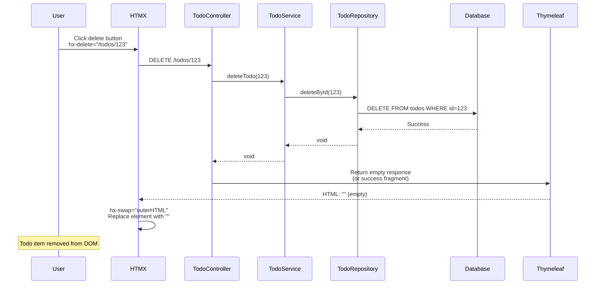
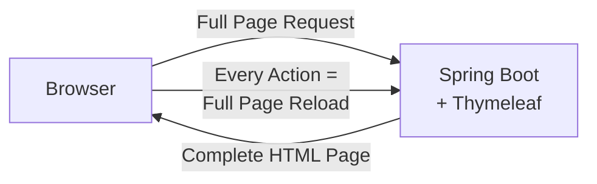
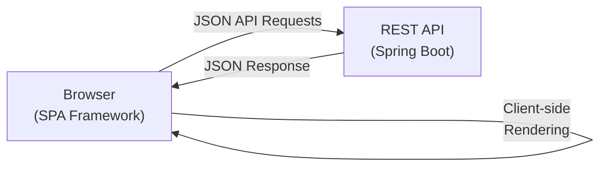
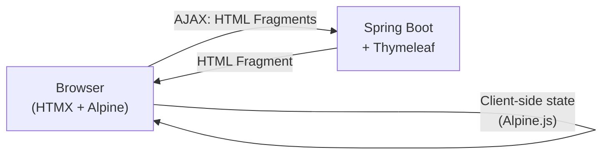

# HTMX + Alpine.js + Spring Boot Learning Path

Progressive tutorial building a **Personal Productivity Hub** - a complete application that evolves from simple content loading to a full-featured, real-time interactive dashboard.

## The Application: TaskFlow Hub

A personal productivity application featuring:
- Dashboard with dynamic widgets
- Task management (todos, notes, projects)
- Bookmark collections
- Search across all content
- Real-time activity feed
- Contact/feedback system

Each lesson adds new features to this single, evolving application.

## Tech Stack

- **Backend**: Spring Boot 4.0.0 + Thymeleaf
- **Frontend Libraries**:
  - HTMX 2.0.4 (hypermedia interactions)
  - Alpine.js 3.14.x (reactive client-side behavior)
  - Tailwind CSS 3.4.x (utility-first styling)
- **Database**: PostgreSQL + Flyway migrations
- **Build**: Maven
- **Java**: 25

## Core Concepts

### HTMX
Extends HTML with attributes to achieve AJAX, WebSockets, and Server-Sent Events directly in markup. Server returns HTML fragments, not JSON.

**Key Attributes:**
- `hx-get/post/put/delete` - HTTP request on element
- `hx-trigger` - event that triggers request
- `hx-target` - where to insert response
- `hx-swap` - how to insert response (innerHTML, outerHTML, etc.)

### Alpine.js
Lightweight JavaScript framework for reactive behavior, similar to Vue.js but in HTML attributes.

**Key Directives:**
- `x-data` - component state
- `x-show/x-if` - conditional rendering
- `x-on` - event handling
- `x-bind` - attribute binding

### Architecture Pattern
**Hypermedia-driven**: Server owns state and UI logic. Client handles presentation and immediate feedback. No separate REST API needed for UI.

---

## High-Level Architecture


### Key Architecture Components

1. **HTMX (Browser)**: Intercepts user actions, makes HTTP requests, swaps HTML responses into DOM
2. **Alpine.js (Browser)**: Handles client-side state for UI interactions (modals, dropdowns, tabs)
3. **Controllers (Server)**: Handle HTTP requests, return HTML fragments via Thymeleaf
4. **Services (Server)**: Business logic, coordinate between controllers and repositories
5. **Repositories (Server)**: Data access layer using Spring Data JPA
6. **Thymeleaf (Server)**: Renders HTML fragments from templates + model data
7. **PostgreSQL**: Persistent data storage

### Request Flow Example

**User clicks "Delete Todo" button:**



---

## Architecture Comparison: Three Approaches

### 1. Pure Server-Side Rendering (Traditional Thymeleaf)



**Characteristics:**
- Every interaction requires full page reload
- Server renders complete HTML pages
- Simple architecture, no JavaScript needed
- Poor UX for interactive features

**Example Flow:**
1. User submits form
2. Browser sends POST request
3. Server processes, redirects to new page
4. Browser requests new page
5. Server renders entire HTML page
6. Browser displays new page (full reload)

---

### 2. Single Page Application (React/Vue/Angular)



**Characteristics:**
- Client-side routing and rendering
- Server provides JSON API only
- Heavy JavaScript bundle
- Complex state management (Redux, Vuex)
- Separate frontend/backend codebases

**Example Flow:**
1. User submits form
2. JavaScript intercepts submit
3. AJAX POST to `/api/todos` with JSON
4. Server returns JSON: `{"id": 123, "title": "..."}`
5. React/Vue updates virtual DOM
6. Browser re-renders affected components
7. Client-side state management syncs

**Stack:**
```
Frontend: React + Redux + React Router + Axios
Backend:  Spring Boot + REST Controllers + Jackson
```

---

### 3. Hypermedia-Driven (HTMX + Alpine.js)



**Characteristics:**
- Server renders HTML fragments (not full pages, not JSON)
- HTMX handles AJAX transparently via HTML attributes
- Alpine.js for client-side UI state
- Minimal JavaScript
- Single codebase (server-side templates)

**Example Flow:**
1. User submits form
2. HTMX intercepts: `hx-post="/todos"`
3. AJAX POST to server
4. Server processes, renders HTML fragment
5. Server returns: `<li class="todo-item">New Todo</li>`
6. HTMX swaps fragment into DOM
7. No page reload, no JSON parsing

**Stack:**
```
Frontend: HTMX (14kb) + Alpine.js (15kb) + Tailwind CSS
Backend:  Spring Boot + Thymeleaf
```

---

## Side-by-Side Comparison

| Aspect | Pure Server-Side | SPA (React/Vue) | HTMX Hybrid |
|--------|-----------------|-----------------|-------------|
| **Page Loads** | Full reload every action | Initial load only | Initial load only |
| **Data Format** | HTML pages | JSON | HTML fragments |
| **JavaScript Size** | ~0 KB | 200-500 KB | ~30 KB |
| **State Management** | Server session | Client-side (complex) | Server-side (simple) |
| **Routing** | Server-side | Client-side | Server-side |
| **SEO** | Excellent | Requires SSR | Excellent |
| **Developer Experience** | Simple | Complex (2 codebases) | Simple (1 codebase) |
| **Learning Curve** | Low | High | Low-Medium |
| **Real-time Updates** | Polling/Manual refresh | WebSocket/Complex | SSE (built-in) |
| **Form Handling** | Traditional POST | JSON + Validation libs | HTMX + Server validation |
| **Error Handling** | Server redirects | Client-side logic | Server-rendered errors |
| **Build Complexity** | None | Webpack/Vite + bundling | None |
| **Testing** | Server-side only | Unit + Integration + E2E | Server-side + minimal JS |
| **Network Payload** | Large (full pages) | Small (JSON) | Medium (fragments) |
| **Time to Interactive** | Fast (no JS) | Slow (large bundle) | Fast (minimal JS) |
| **Code Duplication** | None | Validation on both sides | None |
| **Backend Coupling** | Tight | Loose (API contract) | Tight |

---

## When to Choose HTMX

**Choose HTMX when:**
- Building content-driven applications (dashboards, admin panels, CRUD apps)
- Team prefers server-side development
- Want simple architecture with minimal JavaScript
- Need fast development cycles
- SEO is important
- Real-time updates are needed but not complex

**Choose SPA when:**
- Building highly interactive applications (games, design tools, real-time collaboration)
- Need offline-first capabilities
- Complex client-side state management required
- Mobile app planned (React Native/Vue Native)
- Team has strong frontend expertise

**Choose Pure Server-Side when:**
- Building simple CRUD applications with minimal interactivity
- No JavaScript requirements
- Maximum simplicity needed
- Legacy system maintenance

---

## Application Evolution: Lesson-by-Lesson

### Lesson 1: Foundation - Basic Dashboard
**What We Build**: Empty dashboard with "Load Stats" button

**HTMX Concepts**: `hx-get`, `hx-target`, `hx-swap`

**Features Added:**
- Dashboard page with welcome message
- Button that loads server-generated stats widget
- Basic layout with Tailwind CSS
- CDN setup for HTMX, Alpine.js, Tailwind

**Files Created:**
- `HomeController.java` - serves dashboard and stats fragment
- `templates/layout.html` - base Thymeleaf layout
- `templates/dashboard.html` - main dashboard page
- `templates/fragments/stats-widget.html` - stats fragment

---

### Lesson 2: Interactive Widgets
**What We Build**: Multiple dashboard widgets with different triggers

**HTMX Concepts**: `hx-trigger` (load, click, every), `hx-swap` strategies

**Features Added:**
- Quote of the day (loads on page load)
- Current time widget (updates every 30s)
- Weather widget (click to refresh)
- Different swap strategies demonstrated

**Files Modified:**
- `HomeController.java` - add widget endpoints
- `templates/dashboard.html` - add widget containers
- `templates/fragments/quote-widget.html`
- `templates/fragments/time-widget.html`
- `templates/fragments/weather-widget.html`

---

### Lesson 3: Contact Form
**What We Build**: Feedback/contact form in dashboard

**HTMX Concepts**: `hx-post`, form validation, error handling

**Features Added:**
- Contact form widget in dashboard
- Server-side validation
- Display validation errors inline
- Success message after submission
- Form reset after success

**Files Created:**
- `ContactController.java` - handle form submission
- `dto/ContactRequest.java` - form DTO with validation
- `templates/fragments/contact-form.html`
- `templates/fragments/contact-success.html`

---

### Lesson 4: Todo List (In-Memory)
**What We Build**: Quick task widget for daily todos

**HTMX Concepts**: `hx-post`, `hx-delete`, targeting individual elements

**Features Added:**
- Add new todo (text input + button)
- Display todo list
- Delete individual todos
- Mark todos as complete (toggle)
- In-memory storage (session-based)

**Files Created:**
- `TodoController.java` - CRUD operations
- `model/Todo.java` - simple POJO
- `service/TodoService.java` - in-memory storage
- `templates/fragments/todo-widget.html`
- `templates/fragments/todo-item.html`

---

### Lesson 5: Search Across Content
**What We Build**: Global search for todos and future content

**HTMX Concepts**: `hx-trigger="keyup changed delay:500ms"`, debouncing

**Features Added:**
- Search input in navbar
- Live search with debounce
- Search results dropdown
- Highlight matching terms
- Loading indicator during search

**Files Created:**
- `SearchController.java` - search logic
- `service/SearchService.java` - search across todos
- `templates/fragments/search-results.html`

**Files Modified:**
- `templates/layout.html` - add search to navbar

---

### Lesson 6: UI Enhancements with Alpine.js
**What We Build**: Better UX with client-side interactions

**Alpine Concepts**: `x-data`, `x-show`, `x-on`, `x-transition`

**Features Added:**
- Dropdown menu for user profile
- Modal for settings
- Tabs for dashboard sections
- Collapsible widget panels
- Dark mode toggle (client-side only)

**Files Modified:**
- `templates/layout.html` - add dropdown menu
- `templates/dashboard.html` - add tabs and collapsible panels
- `templates/fragments/settings-modal.html`

---

### Lesson 7: Combined HTMX + Alpine
**What We Build**: Enhanced todo with confirm dialogs

**Concepts**: Alpine for UI state, HTMX for server sync

**Features Added:**
- Confirm dialog before delete (Alpine)
- Multi-step "Add Project" form (Alpine tabs + HTMX submit)
- Form validation preview (Alpine) before server submit (HTMX)
- Optimistic UI updates

**Files Created:**
- `ProjectController.java` - handle project creation
- `templates/fragments/project-form-modal.html`

**Files Modified:**
- `templates/fragments/todo-item.html` - add confirm dialog

---

### Lesson 8: Database Persistence
**What We Build**: Migrate todos to database, add notes feature

**Concepts**: JPA, Flyway, repositories

**Features Added:**
- Persist todos to PostgreSQL
- Add "Notes" feature (title, content, tags)
- CRUD operations for notes
- Flyway migration scripts

**Files Created:**
- `entity/TodoEntity.java` - JPA entity
- `entity/Note.java` - JPA entity
- `repository/TodoRepository.java`
- `repository/NoteRepository.java`
- `NoteController.java`
- `db/migration/V1__initial_schema.sql`
- `templates/notes.html` - notes page
- `templates/fragments/note-card.html`

**Files Modified:**
- `TodoController.java` - use repository
- `TodoService.java` - use database

---

### Lesson 9: Infinite Scroll for Notes
**What We Build**: Notes archive with infinite scroll

**Concepts**: `hx-trigger="revealed"`, pagination, lazy loading

**Features Added:**
- Notes archive page
- Load 20 notes initially
- Infinite scroll to load more
- Loading spinner at bottom
- "No more notes" indicator

**Files Created:**
- `templates/notes-archive.html`
- `templates/fragments/notes-page.html`

**Files Modified:**
- `NoteController.java` - add pagination endpoint

---

### Lesson 10: Bookmark Collections with OOB
**What We Build**: Save bookmarks, update navbar counter

**Concepts**: `hx-swap-oob`, multi-element updates

**Features Added:**
- Bookmark collections feature
- Add bookmark button (updates list + navbar counter)
- Bookmark counter badge in navbar
- Toast notifications
- Update multiple page areas from one request

**Files Created:**
- `entity/Bookmark.java`
- `repository/BookmarkRepository.java`
- `BookmarkController.java`
- `db/migration/V2__bookmarks.sql`
- `templates/bookmarks.html`
- `templates/fragments/bookmark-item.html`
- `templates/fragments/bookmark-counter.html`
- `templates/fragments/toast.html`

**Files Modified:**
- `templates/layout.html` - add bookmark counter

---

### Lesson 11: Advanced Interactions
**What We Build**: Inline editing, attachments

**Concepts**: Edit-in-place, file upload, complex workflows

**Features Added:**
- Click to edit note title/content inline
- Save on blur or Enter key
- Cancel on Escape
- File attachments for notes
- Upload progress indicator
- Drag-and-drop file upload

**Files Created:**
- `AttachmentController.java` - handle file uploads
- `entity/Attachment.java`
- `templates/fragments/note-edit-inline.html`
- `templates/fragments/file-upload.html`

**Files Modified:**
- `templates/fragments/note-card.html` - add inline editing
- `db/migration/V3__attachments.sql`

---

### Lesson 12: Real-Time Activity Feed
**What We Build**: Live activity stream with SSE

**Concepts**: Server-Sent Events, `hx-sse`, real-time updates

**Features Added:**
- Activity feed widget on dashboard
- Real-time updates when actions occur
- "User created a note" notifications
- "User completed a todo" notifications
- Live timestamp updates

**Files Created:**
- `ActivityController.java` - SSE endpoint
- `service/ActivityService.java` - broadcast events
- `model/Activity.java`
- `templates/fragments/activity-feed.html`
- `templates/fragments/activity-item.html`

**Files Modified:**
- All controllers - emit activity events
- `templates/dashboard.html` - add activity feed

---

## Final Project Structure

```
src/main/
├── java/com/muhardin/endy/belajar/htmx/
│   ├── BelajarHtmxApplication.java
│   ├── controller/
│   │   ├── HomeController.java        # Dashboard & widgets
│   │   ├── ContactController.java     # Contact form
│   │   ├── TodoController.java        # Todo CRUD
│   │   ├── SearchController.java      # Global search
│   │   ├── ProjectController.java     # Projects
│   │   ├── NoteController.java        # Notes CRUD
│   │   ├── BookmarkController.java    # Bookmarks
│   │   ├── AttachmentController.java  # File uploads
│   │   └── ActivityController.java    # SSE activity feed
│   ├── entity/
│   │   ├── TodoEntity.java
│   │   ├── Note.java
│   │   ├── Bookmark.java
│   │   └── Attachment.java
│   ├── repository/
│   │   ├── TodoRepository.java
│   │   ├── NoteRepository.java
│   │   ├── BookmarkRepository.java
│   │   └── AttachmentRepository.java
│   ├── dto/
│   │   ├── ContactRequest.java
│   │   ├── TodoRequest.java
│   │   └── NoteRequest.java
│   ├── model/
│   │   ├── Todo.java                  # POJO for lessons 4-7
│   │   └── Activity.java
│   └── service/
│       ├── TodoService.java           # Business logic
│       ├── SearchService.java
│       └── ActivityService.java       # SSE broadcaster
├── resources/
│   ├── templates/
│   │   ├── layout.html                # Base layout with navbar
│   │   ├── dashboard.html             # Main dashboard
│   │   ├── notes.html                 # Notes page
│   │   ├── notes-archive.html         # Notes archive
│   │   ├── bookmarks.html             # Bookmarks page
│   │   └── fragments/
│   │       ├── stats-widget.html
│   │       ├── quote-widget.html
│   │       ├── time-widget.html
│   │       ├── weather-widget.html
│   │       ├── contact-form.html
│   │       ├── contact-success.html
│   │       ├── todo-widget.html
│   │       ├── todo-item.html
│   │       ├── search-results.html
│   │       ├── settings-modal.html
│   │       ├── project-form-modal.html
│   │       ├── note-card.html
│   │       ├── note-edit-inline.html
│   │       ├── notes-page.html
│   │       ├── bookmark-item.html
│   │       ├── bookmark-counter.html
│   │       ├── toast.html
│   │       ├── file-upload.html
│   │       ├── activity-feed.html
│   │       └── activity-item.html
│   ├── static/
│   │   └── uploads/                   # File upload directory
│   ├── db/migration/
│   │   ├── V1__initial_schema.sql     # Todos & Notes tables
│   │   ├── V2__bookmarks.sql          # Bookmarks table
│   │   └── V3__attachments.sql        # Attachments table
│   └── application.properties
```

## Running the Application

```bash
# Start PostgreSQL (via Docker Compose)
docker compose up -d

# Run application
./mvnw spring-boot:run

# Access at http://localhost:8080
```

## Learning Approach

1. **Start at Lesson 1** - Build foundation with simplest HTMX example
2. **Progress sequentially** - Each lesson builds on previous code
3. **Understand before moving on** - Each concept is isolated and explained
4. **Refactor as you learn** - Code evolves naturally (in-memory → database)
5. **Complete working app** - After Lesson 12, you have a full application

## Key Takeaways

By the end, you'll understand:
- **Hypermedia-driven architecture** vs traditional SPA
- **When to use HTMX** vs Alpine.js vs vanilla JS
- **Server-side rendering** with progressive enhancement
- **Real-time updates** without WebSocket complexity
- **Form handling** without JavaScript frameworks
- **Database integration** in hypermedia context
