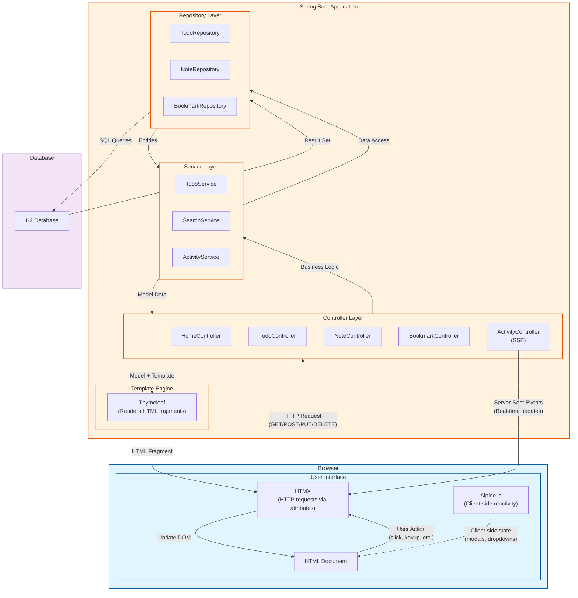
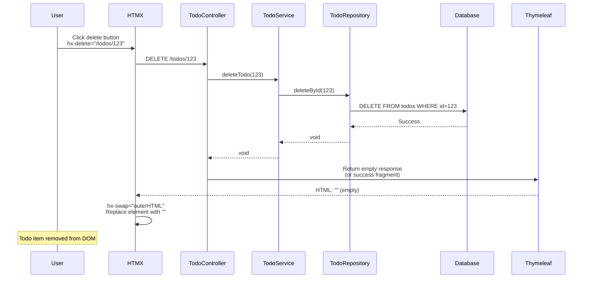
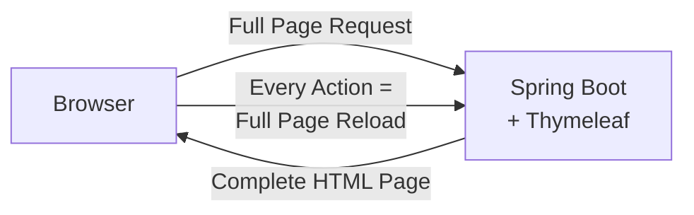
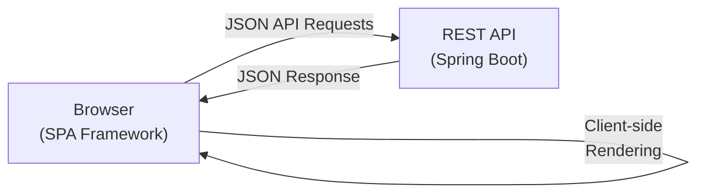
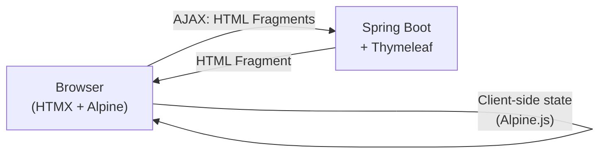

# Jalur Pembelajaran HTMX + Alpine.js + Spring Boot

Tutorial progresif untuk membangun **Personal Productivity Hub** - aplikasi lengkap yang berkembang dari loading konten sederhana menjadi dashboard interaktif real-time yang lengkap.

## Aplikasi: TaskFlow Hub

Aplikasi produktivitas personal dengan fitur:
- Dashboard dengan widget dinamis
- Manajemen task (todos, notes, projects)
- Koleksi bookmark
- Pencarian di semua konten
- Activity feed real-time
- Sistem kontak/feedback

Setiap pelajaran menambahkan fitur baru ke aplikasi yang terus berkembang ini.

## Tech Stack

- **Backend**: Spring Boot 4.0.0 + Thymeleaf
- **Frontend Libraries**:
  - HTMX 2.0.4 (hypermedia interactions)
  - Alpine.js 3.14.x (reactive client-side behavior)
  - Tailwind CSS 4.x (utility-first styling)
- **Database**: H2 (file-based) + Flyway migrations
- **Build**: Maven
- **Java**: 25

## Konsep Inti

### HTMX
Memperluas HTML dengan atribut untuk mencapai AJAX, WebSockets, dan Server-Sent Events langsung di markup. Server mengembalikan fragment HTML, bukan JSON.

**Atribut Utama:**
- `hx-get/post/put/delete` - HTTP request pada element
- `hx-trigger` - event yang memicu request
- `hx-target` - tempat memasukkan response
- `hx-swap` - cara memasukkan response (innerHTML, outerHTML, dll.)

### Alpine.js
Framework JavaScript ringan untuk behavior reaktif, mirip Vue.js tapi dalam atribut HTML.

**Directive Utama:**
- `x-data` - state component
- `x-show/x-if` - conditional rendering
- `x-on` - event handling
- `x-bind` - attribute binding

### Pola Arsitektur
**Hypermedia-driven**: Server memiliki state dan UI logic. Client menangani presentasi dan feedback langsung. Tidak perlu REST API terpisah untuk UI.

---

## Arsitektur High-Level



### Komponen Arsitektur Utama

1. **HTMX (Browser)**: Menangkap aksi user, membuat HTTP request, menukar HTML response ke DOM
2. **Alpine.js (Browser)**: Menangani state client-side untuk interaksi UI (modals, dropdowns, tabs)
3. **Controllers (Server)**: Menangani HTTP request, mengembalikan fragment HTML via Thymeleaf
4. **Services (Server)**: Business logic, koordinasi antara controller dan repository
5. **Repositories (Server)**: Data access layer menggunakan Spring Data JPA
6. **Thymeleaf (Server)**: Render fragment HTML dari template + model data
7. **H2 Database**: Penyimpanan data persisten (file-based untuk development)

### Contoh Request Flow

**User mengklik tombol "Delete Todo":**



---

## Perbandingan Arsitektur: Tiga Pendekatan

### 1. Pure Server-Side Rendering (Thymeleaf Tradisional)



**Karakteristik:**
- Setiap interaksi memerlukan full page reload
- Server render halaman HTML lengkap
- Arsitektur sederhana, tidak perlu JavaScript
- UX kurang baik untuk fitur interaktif

**Contoh Flow:**
1. User submit form
2. Browser kirim POST request
3. Server proses, redirect ke halaman baru
4. Browser request halaman baru
5. Server render seluruh halaman HTML
6. Browser tampilkan halaman baru (full reload)

---

### 2. Single Page Application (React/Vue/Angular)



**Karakteristik:**
- Client-side routing dan rendering
- Server hanya menyediakan JSON API
- JavaScript bundle besar
- State management kompleks (Redux, Vuex)
- Codebase frontend/backend terpisah

**Contoh Flow:**
1. User submit form
2. JavaScript intercept submit
3. AJAX POST ke `/api/todos` dengan JSON
4. Server return JSON: `{"id": 123, "title": "..."}`
5. React/Vue update virtual DOM
6. Browser re-render affected components
7. Client-side state management sync

**Stack:**
```
Frontend: React + Redux + React Router + Axios
Backend:  Spring Boot + REST Controllers + Jackson
```

---

### 3. Hypermedia-Driven (HTMX + Alpine.js)



**Karakteristik:**
- Server render fragment HTML (bukan full page, bukan JSON)
- HTMX menangani AJAX secara transparan via atribut HTML
- Alpine.js untuk UI state client-side
- JavaScript minimal
- Single codebase (server-side templates)

**Contoh Flow:**
1. User submit form
2. HTMX intercept: `hx-post="/todos"`
3. AJAX POST ke server
4. Server proses, render fragment HTML
5. Server return: `<li class="todo-item">New Todo</li>`
6. HTMX swap fragment ke DOM
7. Tidak ada page reload, tidak ada JSON parsing

**Stack:**
```
Frontend: HTMX (14kb) + Alpine.js (15kb) + Tailwind CSS
Backend:  Spring Boot + Thymeleaf
```

---

## Perbandingan Side-by-Side

| Aspek | Pure Server-Side | SPA (React/Vue) | HTMX Hybrid |
|--------|-----------------|-----------------|-------------|
| **Page Loads** | Full reload setiap aksi | Initial load saja | Initial load saja |
| **Format Data** | HTML pages | JSON | HTML fragments |
| **Ukuran JavaScript** | ~0 KB | 200-500 KB | ~30 KB |
| **State Management** | Server session | Client-side (kompleks) | Server-side (sederhana) |
| **Routing** | Server-side | Client-side | Server-side |
| **SEO** | Excellent | Butuh SSR | Excellent |
| **Developer Experience** | Sederhana | Kompleks (2 codebase) | Sederhana (1 codebase) |
| **Learning Curve** | Rendah | Tinggi | Rendah-Sedang |
| **Real-time Updates** | Polling/Manual refresh | WebSocket/Kompleks | SSE (built-in) |
| **Form Handling** | Traditional POST | JSON + Validation libs | HTMX + Server validation |
| **Error Handling** | Server redirects | Client-side logic | Server-rendered errors |
| **Build Complexity** | Tidak ada | Webpack/Vite + bundling | Tidak ada |
| **Testing** | Server-side saja | Unit + Integration + E2E | Server-side + minimal JS |
| **Network Payload** | Besar (full pages) | Kecil (JSON) | Sedang (fragments) |
| **Time to Interactive** | Cepat (no JS) | Lambat (large bundle) | Cepat (minimal JS) |
| **Code Duplication** | Tidak ada | Validation di kedua sisi | Tidak ada |
| **Backend Coupling** | Tight | Loose (API contract) | Tight |

---

## Kapan Memilih HTMX

**Pilih HTMX ketika:**
- Membangun aplikasi content-driven (dashboard, admin panel, CRUD apps)
- Tim lebih suka server-side development
- Ingin arsitektur sederhana dengan JavaScript minimal
- Butuh development cycle cepat
- SEO penting
- Real-time updates diperlukan tapi tidak kompleks

**Pilih SPA ketika:**
- Membangun aplikasi highly interactive (games, design tools, real-time collaboration)
- Butuh offline-first capabilities
- Client-side state management kompleks diperlukan
- Mobile app direncanakan (React Native/Vue Native)
- Tim punya expertise frontend kuat

**Pilih Pure Server-Side ketika:**
- Membangun CRUD application sederhana dengan interaktivitas minimal
- Tidak ada requirement JavaScript
- Butuh kesederhanaan maksimal
- Maintenance sistem legacy

---

## Evolusi Aplikasi: Pelajaran Demi Pelajaran

### Pelajaran 1: Foundation - Dashboard Dasar
**Yang Dibangun**: Dashboard kosong dengan tombol "Load Stats"

**Konsep HTMX**: `hx-get`, `hx-target`, `hx-swap`

**Fitur Ditambahkan:**
- Halaman dashboard dengan pesan selamat datang
- Tombol yang memuat widget stats dari server
- Layout dasar dengan Tailwind CSS
- Setup CDN untuk HTMX, Alpine.js, Tailwind

**File Dibuat:**
- `HomeController.java` - melayani dashboard dan stats fragment
- `templates/layout.html` - base Thymeleaf layout
- `templates/dashboard.html` - halaman dashboard utama
- `templates/fragments/stats-widget.html` - stats fragment

---

### Pelajaran 2: Widget Interaktif
**Yang Dibangun**: Multiple dashboard widget dengan trigger berbeda

**Konsep HTMX**: `hx-trigger` (load, click, every), strategi `hx-swap`

**Fitur Ditambahkan:**
- Quote of the day (load saat page load)
- Widget current time (update setiap 30s)
- Widget weather (click untuk refresh)
- Demonstrasi strategi swap berbeda

**File Dimodifikasi:**
- `HomeController.java` - tambah widget endpoints
- `templates/dashboard.html` - tambah widget containers
- `templates/fragments/quote-widget.html`
- `templates/fragments/time-widget.html`
- `templates/fragments/weather-widget.html`

---

### Pelajaran 3: Form Kontak
**Yang Dibangun**: Form feedback/kontak di dashboard

**Konsep HTMX**: `hx-post`, validasi form, error handling

**Fitur Ditambahkan:**
- Widget contact form di dashboard
- Validasi server-side
- Tampilkan validation error inline
- Success message setelah submission
- Form reset setelah sukses

**File Dibuat:**
- `ContactController.java` - handle form submission
- `dto/ContactRequest.java` - form DTO dengan validasi
- `templates/fragments/contact-form.html`
- `templates/fragments/contact-success.html`

---

### Pelajaran 4: Todo List CRUD dengan Database
**Yang Dibangun**: Widget quick task untuk daily todos dengan database persistence

**Konsep HTMX**: `hx-post`, `hx-put`, `hx-delete`, targeting individual elements

**Konsep Database**: JPA entities, repositories, Flyway migrations

**Fitur Ditambahkan:**
- Tambah todo baru (text input + button)
- Tampilkan todo list
- Hapus individual todos dengan konfirmasi
- Mark todos sebagai complete (toggle)
- Database persistence dengan H2 file-based
- H2 Console untuk inspect database

**File Dibuat:**
- `TodoController.java` - operasi CRUD
- `model/Todo.java` - JPA entity dengan annotations
- `repository/TodoRepository.java` - JPA repository
- `service/TodoService.java` - business logic dengan database
- `db/migration/V1__create_todos_table.sql` - Flyway migration
- `templates/fragments/todo-list.html`
- `templates/fragments/todo-item.html`

**Catatan:**
- Focus tetap pada HTMX, database hanya "behind the scene"
- Data persist saat restart aplikasi

---

### Pelajaran 5: Pencarian di Seluruh Konten
**Yang Dibangun**: Global search untuk todos dan konten future

**Konsep HTMX**: `hx-trigger="keyup changed delay:500ms"`, debouncing

**Fitur Ditambahkan:**
- Search input di navbar
- Live search dengan debounce
- Search results dropdown
- Highlight matching terms
- Loading indicator saat search

**File Dibuat:**
- `SearchController.java` - logic search
- `service/SearchService.java` - search across todos
- `templates/fragments/search-results.html`

**File Dimodifikasi:**
- `templates/layout.html` - tambah search ke navbar

---

### Pelajaran 6: Peningkatan UI dengan Alpine.js
**Yang Dibangun**: UX lebih baik dengan interaksi client-side

**Konsep Alpine**: `x-data`, `x-show`, `x-on`, `x-transition`

**Fitur Ditambahkan:**
- Dropdown menu untuk user profile
- Modal untuk settings
- Tabs untuk dashboard sections
- Collapsible widget panels
- Dark mode toggle (client-side only)

**File Dimodifikasi:**
- `templates/layout.html` - tambah dropdown menu
- `templates/dashboard.html` - tambah tabs dan collapsible panels
- `templates/fragments/settings-modal.html`

---

### Pelajaran 7: Kombinasi HTMX + Alpine
**Yang Dibangun**: Enhanced todo dengan confirm dialog

**Konsep**: Alpine untuk UI state, HTMX untuk server sync

**Fitur Ditambahkan:**
- Confirm dialog sebelum delete (Alpine)
- Multi-step "Add Project" form (Alpine tabs + HTMX submit)
- Form validation preview (Alpine) sebelum server submit (HTMX)
- Optimistic UI updates

**File Dibuat:**
- `ProjectController.java` - handle project creation
- `templates/fragments/project-form-modal.html`

**File Dimodifikasi:**
- `templates/fragments/todo-item.html` - tambah confirm dialog

---

### Pelajaran 8: Infinite Scroll untuk Notes
**Yang Dibangun**: Notes archive dengan infinite scroll

**Konsep**: `hx-trigger="revealed"`, pagination, lazy loading

**Fitur Ditambahkan:**
- Halaman notes archive
- Load 20 notes awalnya
- Infinite scroll untuk load more
- Loading spinner di bottom
- Indikator "No more notes"

**File Dibuat:**
- `templates/notes-archive.html`
- `templates/fragments/notes-page.html`

**File Dimodifikasi:**
- `NoteController.java` - tambah pagination endpoint

---

### Pelajaran 9: Koleksi Bookmark dengan OOB
**Yang Dibangun**: Simpan bookmarks, update navbar counter

**Konsep**: `hx-swap-oob`, multi-element updates

**Fitur Ditambahkan:**
- Fitur bookmark collections
- Tombol add bookmark (update list + navbar counter)
- Bookmark counter badge di navbar
- Toast notifications
- Update multiple page area dari satu request

**File Dibuat:**
- `entity/Bookmark.java`
- `repository/BookmarkRepository.java`
- `BookmarkController.java`
- `db/migration/V2__bookmarks.sql`
- `templates/bookmarks.html`
- `templates/fragments/bookmark-item.html`
- `templates/fragments/bookmark-counter.html`
- `templates/fragments/toast.html`

**File Dimodifikasi:**
- `templates/layout.html` - tambah bookmark counter

---

### Pelajaran 10: Interaksi Advanced
**Yang Dibangun**: Inline editing, attachments

**Konsep**: Edit-in-place, file upload, complex workflows

**Fitur Ditambahkan:**
- Click untuk edit note title/content inline
- Save on blur atau Enter key
- Cancel on Escape
- File attachments untuk notes
- Upload progress indicator
- Drag-and-drop file upload

**File Dibuat:**
- `AttachmentController.java` - handle file uploads
- `entity/Attachment.java`
- `templates/fragments/note-edit-inline.html`
- `templates/fragments/file-upload.html`

**File Dimodifikasi:**
- `templates/fragments/note-card.html` - tambah inline editing
- `db/migration/V3__attachments.sql`

---

### Pelajaran 11: Real-Time Activity Feed
**Yang Dibangun**: Live activity stream dengan SSE

**Konsep**: Server-Sent Events, `hx-sse`, real-time updates

**Fitur Ditambahkan:**
- Activity feed widget di dashboard
- Real-time updates saat aksi terjadi
- Notifikasi "User created a note"
- Notifikasi "User completed a todo"
- Live timestamp updates

**File Dibuat:**
- `ActivityController.java` - SSE endpoint
- `service/ActivityService.java` - broadcast events
- `model/Activity.java`
- `templates/fragments/activity-feed.html`
- `templates/fragments/activity-item.html`

**File Dimodifikasi:**
- Semua controller - emit activity events
- `templates/dashboard.html` - tambah activity feed

---

## Struktur Proyek Final

```
src/main/
├── java/com/muhardin/endy/belajar/htmx/
│   ├── BelajarHtmxApplication.java
│   ├── controller/
│   │   ├── HomeController.java        # Dashboard & widgets
│   │   ├── ContactController.java     # Contact form
│   │   ├── TodoController.java        # Todo CRUD
│   │   ├── SearchController.java      # Global search
│   │   ├── ProjectController.java     # Projects
│   │   ├── NoteController.java        # Notes CRUD
│   │   ├── BookmarkController.java    # Bookmarks
│   │   ├── AttachmentController.java  # File uploads
│   │   └── ActivityController.java    # SSE activity feed
│   ├── entity/
│   │   ├── TodoEntity.java
│   │   ├── Note.java
│   │   ├── Bookmark.java
│   │   └── Attachment.java
│   ├── repository/
│   │   ├── TodoRepository.java
│   │   ├── NoteRepository.java
│   │   ├── BookmarkRepository.java
│   │   └── AttachmentRepository.java
│   ├── dto/
│   │   ├── ContactRequest.java
│   │   ├── TodoRequest.java
│   │   └── NoteRequest.java
│   ├── model/
│   │   ├── Todo.java                  # POJO untuk pelajaran 4-7
│   │   └── Activity.java
│   └── service/
│       ├── TodoService.java           # Business logic
│       ├── SearchService.java
│       └── ActivityService.java       # SSE broadcaster
├── resources/
│   ├── templates/
│   │   ├── layout.html                # Base layout dengan navbar
│   │   ├── dashboard.html             # Dashboard utama
│   │   ├── notes.html                 # Halaman notes
│   │   ├── notes-archive.html         # Notes archive
│   │   ├── bookmarks.html             # Halaman bookmarks
│   │   └── fragments/
│   │       ├── stats-widget.html
│   │       ├── quote-widget.html
│   │       ├── time-widget.html
│   │       ├── weather-widget.html
│   │       ├── contact-form.html
│   │       ├── contact-success.html
│   │       ├── todo-widget.html
│   │       ├── todo-item.html
│   │       ├── search-results.html
│   │       ├── settings-modal.html
│   │       ├── project-form-modal.html
│   │       ├── note-card.html
│   │       ├── note-edit-inline.html
│   │       ├── notes-page.html
│   │       ├── bookmark-item.html
│   │       ├── bookmark-counter.html
│   │       ├── toast.html
│   │       ├── file-upload.html
│   │       ├── activity-feed.html
│   │       └── activity-item.html
│   ├── static/
│   │   └── uploads/                   # Direktori file upload
│   ├── db/migration/
│   │   ├── V1__initial_schema.sql     # Tabel Todos & Notes
│   │   ├── V2__bookmarks.sql          # Tabel Bookmarks
│   │   └── V3__attachments.sql        # Tabel Attachments
│   └── application.properties
```

## Menjalankan Aplikasi

```bash
# Start PostgreSQL (via Docker Compose)
docker compose up -d

# Run application
./mvnw spring-boot:run

# Akses di http://localhost:8080
```

## Pendekatan Pembelajaran

1. **Mulai di Pelajaran 1** - Bangun fondasi dengan contoh HTMX paling sederhana
2. **Progress secara berurutan** - Setiap pelajaran membangun di atas kode sebelumnya
3. **Pahami sebelum lanjut** - Setiap konsep diisolasi dan dijelaskan
4. **Refactor sambil belajar** - Kode berkembang secara natural (in-memory → database)
5. **Aplikasi lengkap** - Setelah Pelajaran 11, Anda punya aplikasi penuh

## Poin-Poin Penting

Di akhir pembelajaran, Anda akan memahami:
- **Arsitektur Hypermedia-driven** vs SPA tradisional
- **Kapan menggunakan HTMX** vs Alpine.js vs vanilla JS
- **Server-side rendering** dengan progressive enhancement
- **Real-time updates** tanpa kompleksitas WebSocket
- **Form handling** tanpa JavaScript framework
- **Integrasi database** dalam konteks hypermedia
